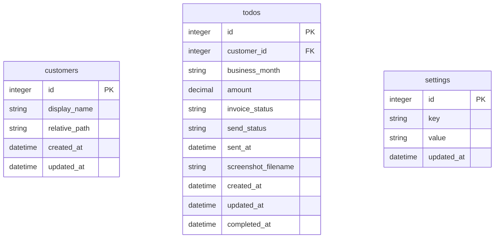

# 开票待办助手 - 产品需求文档

## 1. 产品概述

开票待办助手是一款本地网页工具，旨在解决财务人员在发票管理过程中遇到的文件夹层级深、状态追踪困难、文件定位繁琐等问题。通过统一的截图粘贴入口和智能化的状态管理，帮助用户高效管理开票流程。

- **目标用户**：财务人员、开票专员
- **核心价值**：简化截图归档流程，清晰追踪开票和发送状态，快速定位发票文件

## 2. 核心功能

### 2.1 功能模块

1. **主页面**：截图粘贴区、待办列表、状态管理
2. **历史记录页面**：已开票记录查询与筛选
3. **设置页面**：根目录配置、客户管理

### 2.2 页面详情

| 页面名称 | 模块名称 | 功能描述 |
|---------|---------|---------|
| 主页面 | 截图粘贴区 | 点击后按Ctrl+V粘贴截图，弹出信息填写窗口 |
| 主页面 | 待办列表 | 表格展示所有待办，支持筛选、操作按钮 |
| 主页面 | 状态刷新 | 扫描invoices文件夹更新开票状态 |
| 主页面 | 查重提醒 | 同客户同月重复添加时弹窗警告 |
| 主页面 | 遗漏检查 | 列出当月无待办的客户 |
| 历史记录 | 记录列表 | 展示所有已开票的待办记录 |
| 历史记录 | 筛选功能 | 按客户、业务月份、发送状态筛选 |
| 设置页面 | 根目录配置 | 首次使用设置根目录路径 |
| 设置页面 | 客户管理 | 支持Excel导入、手动增删改客户 |

## 3. 核心流程

```mermaid
graph TD
    A[用户飞书/微信截图] --> B[打开工具网页]
    B --> C[在粘贴区按 Ctrl+V]
    C --> D[弹出窗口: 选择客户、业务月份、金额、可重命名图片]
    D --> E[确认后工具自动保存图片到 根目录/客户路径/业务月份/screenshots/]
    E --> F[生成待办，开票状态=待开票，发送状态=未发送]
    G[用户从钉钉下载发票] --> H[在待办列表点击"打开文件夹"]
    H --> I[手动将发票放入 invoices/ 子文件夹]
    I --> J[点击"刷新状态"按钮 → 开票状态变为已开票]
    K[用户通过微信发送发票给客户] --> L[点击"标记已发送" → 发送状态变为已发送]
```

## 4. 用户界面设计

### 4.1 设计风格

- **主色调**：专业蓝色系（#2563eb）作为主色，搭配中性灰色背景
- **辅助色**：成功绿色（#10b981）、警告橙色（#f59e0b）、错误红色（#ef4444）
- **按钮风格**：圆角矩形按钮，带轻微阴影，hover时有微妙的上浮效果
- **字体**：使用思源黑体或系统默认中文字体，标题16-18px，正文14px
- **布局风格**：顶部导航栏 + 主内容区卡片式布局
- **图标风格**：简洁线性图标，与文字配合使用

### 4.2 页面设计概览

| 页面名称 | 模块名称 | UI元素 |
|---------|---------|--------|
| 主页面 | 截图粘贴区 | 虚线边框卡片，中央提示文字，拖拽高亮效果 |
| 主页面 | 待办列表表格 | 表头固定，行hover高亮，超时行浅红背景 |
| 主页面 | 操作按钮组 | 图标+文字按钮，状态区分颜色 |
| 主页面 | 弹窗表单 | 模态框，图片预览，下拉选择，输入框 |
| 历史记录 | 筛选栏 | 下拉选择器，日期选择器，搜索框 |
| 设置页面 | 客户列表 | 可编辑表格，导入按钮，操作列 |

### 4.3 响应式设计

- **桌面优先**：主要在桌面端使用，最小宽度1200px
- **表格适配**：列宽自适应，必要时横向滚动
- **弹窗适配**：居中显示，最大宽度600px

## 5. 数据存储

### 5.1 数据模型



### 5.2 状态定义

- **开票状态 (invoice_status)**：
  - `pending`：待开票
  - `done`：已开票

- **发送状态 (send_status)**：
  - `unsent`：未发送
  - `sent`：已发送

## 6. 验收标准

1. 导入客户列表，设置根目录
2. 粘贴截图，填写信息，确认后文件保存到正确路径，待办列表生成记录
3. 待办列表显示开票状态=待开票，发送状态=未发送
4. 在对应月份下手动创建 invoices/ 并放入发票文件，点击"刷新状态"，开票状态变为已开票
5. 点击"标记已发送"，发送状态变为已发送
6. "发送给客户"按钮打开 invoices/ 文件夹并选中文件
7. 同一客户同月重复添加弹警告
8. "检查当月遗漏"正确列出客户