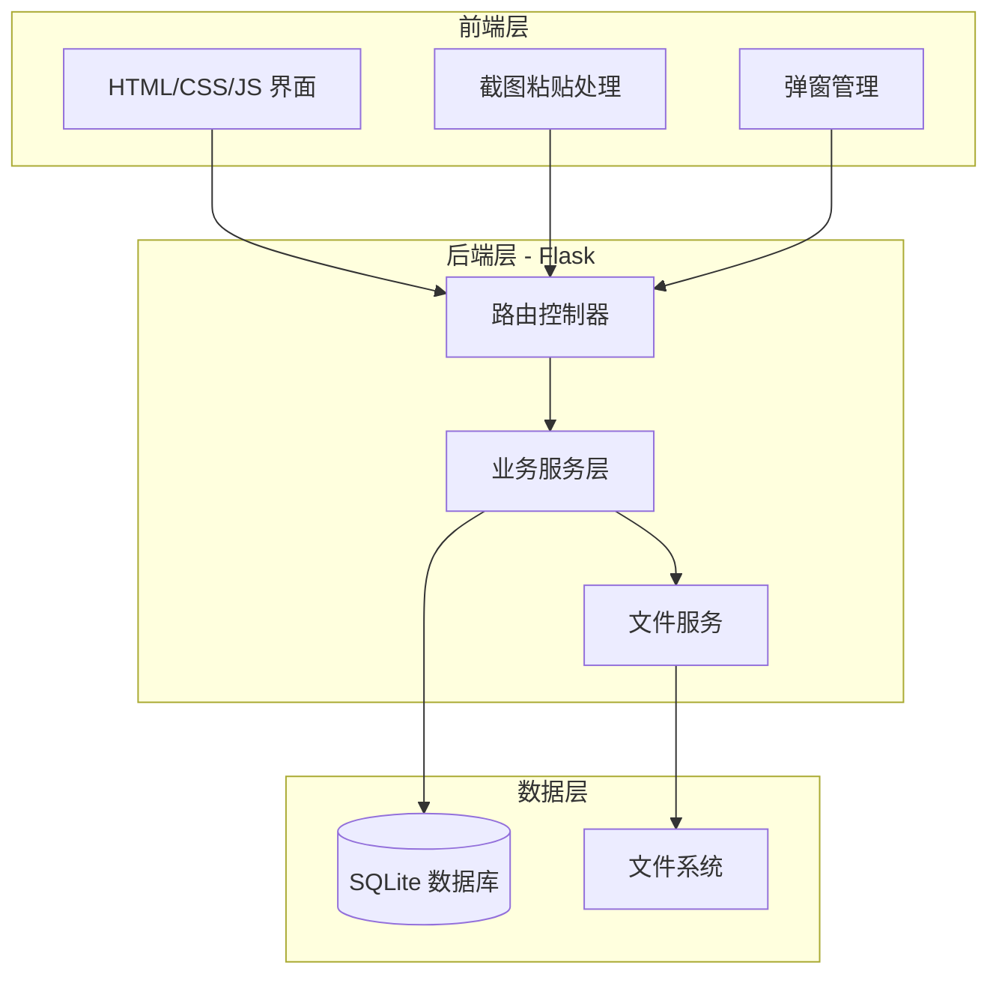
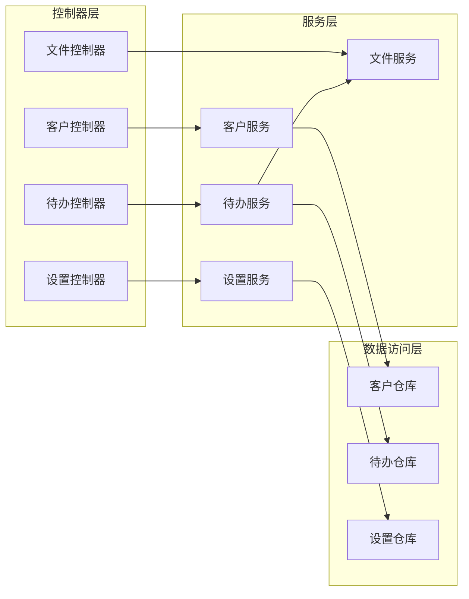

# 开票待办助手 - 技术架构文档

## 1. 架构设计



## 2. 技术说明

- **前端**：原生 HTML5 + CSS3 + JavaScript（无框架依赖，轻量化）
- **后端**：Python 3.8+ + Flask 2.x
- **数据库**：SQLite 3（单文件数据库，无需额外安装）
- **启动方式**：双击 start.bat 启动本地服务

## 3. 路由定义

| 路由 | 方法 | 用途 |
|------|------|------|
| `/` | GET | 主页面（待办列表） |
| `/api/customers` | GET | 获取客户列表 |
| `/api/customers` | POST | 添加客户 |
| `/api/customers/<id>` | PUT | 更新客户 |
| `/api/customers/<id>` | DELETE | 删除客户 |
| `/api/customers/import` | POST | Excel导入客户 |
| `/api/todos` | GET | 获取待办列表 |
| `/api/todos` | POST | 创建待办（含截图上传） |
| `/api/todos/<id>` | PUT | 更新待办 |
| `/api/todos/<id>` | DELETE | 删除待办 |
| `/api/todos/refresh-status` | POST | 刷新开票状态 |
| `/api/todos/<id>/mark-sent` | POST | 标记已发送 |
| `/api/todos/check-duplicate` | POST | 检查重复待办 |
| `/api/todos/missing-current-month` | GET | 获取当月无待办客户 |
| `/api/settings` | GET | 获取设置 |
| `/api/settings` | POST | 保存设置 |
| `/api/open-folder` | POST | 打开文件夹 |
| `/api/history` | GET | 获取历史记录 |
| `/api/export-customers-template` | GET | 导出客户导入模板 |

## 4. API 定义

### 4.1 客户相关

```typescript
// 客户数据结构
interface Customer {
    id: number;
    display_name: string;
    relative_path: string;
    created_at: string;
    updated_at: string;
}

// 添加客户请求
interface CreateCustomerRequest {
    display_name: string;
    relative_path: string;
}

// 导入客户响应
interface ImportCustomersResponse {
    success: boolean;
    imported_count: number;
    errors: string[];
}
```

### 4.2 待办相关

```typescript
// 待办数据结构
interface Todo {
    id: number;
    customer_id: number;
    customer_name: string;
    customer_path: string;
    business_month: string;  // YYYY-MM
    amount: number | null;
    invoice_status: 'pending' | 'done';
    send_status: 'unsent' | 'sent';
    sent_at: string | null;
    screenshot_filename: string;
    created_at: string;
    updated_at: string;
    completed_at: string | null;
}

// 创建待办请求
interface CreateTodoRequest {
    customer_id: number;
    business_month: string;
    amount?: number;
    filename: string;
    image_data: string;  // base64
}

// 待办列表查询参数
interface TodoListQuery {
    send_status?: 'unsent' | 'sent' | 'all';
    customer_id?: number;
    business_month?: string;
}
```

### 4.3 设置相关

```typescript
// 设置数据结构
interface Settings {
    root_directory: string;
}

// 保存设置请求
interface SaveSettingsRequest {
    root_directory: string;
}
```

## 5. 服务架构图



## 6. 数据模型

### 6.1 数据模型定义


### 6.2 数据定义语言

```sql
-- 客户表
CREATE TABLE IF NOT EXISTS customers (
    id INTEGER PRIMARY KEY AUTOINCREMENT,
    display_name TEXT NOT NULL UNIQUE,
    relative_path TEXT NOT NULL,
    created_at TIMESTAMP DEFAULT CURRENT_TIMESTAMP,
    updated_at TIMESTAMP DEFAULT CURRENT_TIMESTAMP
);

-- 待办表
CREATE TABLE IF NOT EXISTS todos (
    id INTEGER PRIMARY KEY AUTOINCREMENT,
    customer_id INTEGER NOT NULL,
    business_month TEXT NOT NULL,
    amount DECIMAL(10, 2),
    invoice_status TEXT DEFAULT 'pending',
    send_status TEXT DEFAULT 'unsent',
    sent_at TIMESTAMP,
    screenshot_filename TEXT NOT NULL,
    created_at TIMESTAMP DEFAULT CURRENT_TIMESTAMP,
    updated_at TIMESTAMP DEFAULT CURRENT_TIMESTAMP,
    completed_at TIMESTAMP,
    FOREIGN KEY (customer_id) REFERENCES customers(id) ON DELETE CASCADE
);

-- 设置表
CREATE TABLE IF NOT EXISTS settings (
    id INTEGER PRIMARY KEY AUTOINCREMENT,
    key TEXT NOT NULL UNIQUE,
    value TEXT,
    updated_at TIMESTAMP DEFAULT CURRENT_TIMESTAMP
);

-- 索引
CREATE INDEX IF NOT EXISTS idx_todos_customer_month ON todos(customer_id, business_month);
CREATE INDEX IF NOT EXISTS idx_todos_status ON todos(invoice_status, send_status);
CREATE INDEX IF NOT EXISTS idx_todos_created ON todos(created_at);

-- 初始设置
INSERT OR IGNORE INTO settings (key, value) VALUES ('root_directory', '');
```

## 7. 文件目录结构

```
项目根目录/
├── app.py                 # Flask主应用
├── models.py              # 数据模型定义
├── routes/                # 路由模块
│   ├── __init__.py
│   ├── customers.py       # 客户相关路由
│   ├── todos.py           # 待办相关路由
│   ├── settings.py        # 设置相关路由
│   └── files.py           # 文件操作路由
├── services/              # 业务服务层
│   ├── __init__.py
│   ├── customer_service.py
│   ├── todo_service.py
│   ├── settings_service.py
│   └── file_service.py
├── static/                # 静态资源
│   ├── css/
│   │   └── style.css
│   ├── js/
│   │   └── app.js
│   └── images/
├── templates/             # HTML模板
│   ├── index.html         # 主页面
│   └── history.html       # 历史记录页面
├── data/                  # 数据目录
│   └── invoice_helper.db  # SQLite数据库
├── requirements.txt       # Python依赖
└── start.bat              # Windows启动脚本
```

## 8. 用户数据目录结构

```
{根目录}/                          # 用户设置的根目录，如 D:\资料
├── {客户相对路径}/                # 如 运营商\移动\广东
│   ├── {业务月份}/                # 如 2024-01
│   │   ├── screenshots/          # 截图存放目录
│   │   │   └── {客户名}_{月份}_{时间戳}.png
│   │   └── invoices/              # 发票存放目录
│   │       └── *.pdf / *.xml / *.ofd
```

## 9. 关键技术实现

### 9.1 截图粘贴处理

```javascript
// 前端监听paste事件
document.addEventListener('paste', async (e) => {
    const items = e.clipboardData.items;
    for (let item of items) {
        if (item.type.indexOf('image') !== -1) {
            const blob = item.getAsFile();
            const reader = new FileReader();
            reader.onload = (event) => {
                // 显示弹窗，让用户填写信息
                showUploadModal(event.target.result);
            };
            reader.readAsDataURL(blob);
        }
    }
});
```

### 9.2 文件夹打开与文件选中

```python
# 后端使用subprocess打开文件夹并选中文件
import subprocess
import platform

def open_folder_and_select_files(folder_path):
    """打开文件夹并选中其中的文件"""
    if platform.system() == 'Windows':
        # 使用explorer /select选中文件
        files = os.listdir(folder_path)
        if files:
            first_file = os.path.join(folder_path, files[0])
            subprocess.run(['explorer', '/select,', first_file])
        else:
            subprocess.run(['explorer', folder_path])
```

### 9.3 开票状态刷新

```python
def refresh_invoice_status(root_dir, todos):
    """扫描invoices文件夹，更新开票状态"""
    invoice_extensions = {'.pdf', '.xml', '.ofd'}
    for todo in todos:
        if todo.invoice_status == 'done':
            continue
        invoice_dir = os.path.join(
            root_dir, 
            todo.customer_path, 
            todo.business_month, 
            'invoices'
        )
        if os.path.exists(invoice_dir):
            files = os.listdir(invoice_dir)
            has_invoice = any(
                os.path.splitext(f)[1].lower() in invoice_extensions 
                for f in files
            )
            if has_invoice:
                todo.invoice_status = 'done'
                todo.completed_at = datetime.now()
    return todos
```

## 10. 安全考虑

1. **本地运行**：仅监听 127.0.0.1，不暴露到外网
2. **路径验证**：所有文件操作验证路径在根目录范围内，防止目录遍历攻击
3. **输入验证**：前端和后端双重验证用户输入
4. **文件类型限制**：仅允许上传图片文件（png, jpg, jpeg）